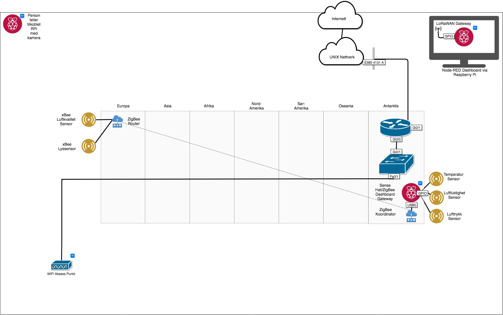

# IoT-Lab-gruppe-A

Her publiseres kode, konfigurasjoner o.l. relatert til Forstudie for Internet of Things bachelor oppgaven.

## Forstudie for Internet of Things
Instituttet vil se på mulighetene for å gjøre oppgraderinger inne på kommunikasjonsteknologi laben. Hvordan kan IoT implementeres inn på eksisterende lab? Hvilke typer konsepter vil spesielt egne seg i undervisning, eksperimentering og forskningsøyemed? Hva slags utstyr og oppgraderinger må gjennomføres for at dette blir en interessant og spennende IoT lab. Det grunnleggende vil være IoT infrastrukturen og deretter kan andre tillegg komplimenteres. Vurderinger innen sikkerhet, personvern og funksjonalitet vil bli påakrevd. Tekniske utprøvelser vil det også være behov for.

## Opsett på LAB

---
## Diverse
---
### Node-RED Dashboard 
IP-adresse: 192.168.1.26

Port: 1880

Dashboard link: http://192.168.1.26:1880/ui/#/0

---
### MQTT Temaer
Luftkvalitet: xbee/airquality

Lysstyrke: xbee/lux

Luftfuktighet: sense/humidity

Atmosfærisk trykk: sense/pressure

Temperatur: sense/temperature

---
### MQTT Opsett
Server: 192.168.1.26

Port: 1883

Client ID: testtemp

---
